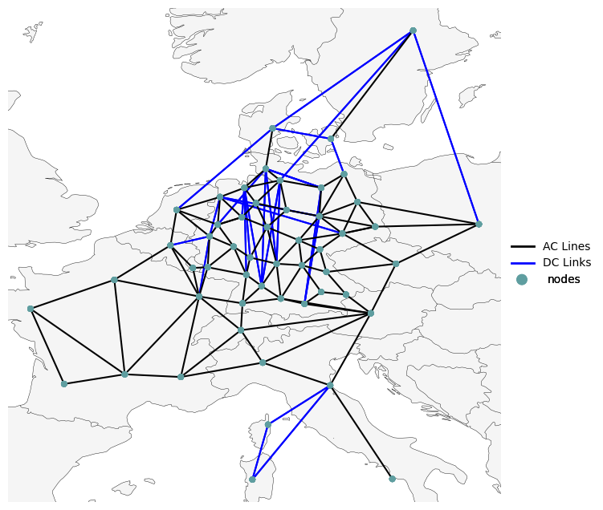

<!--
SPDX-FileCopyrightText: Contributors to PyPSA-Eur <https://github.com/pypsa/pypsa-eur>
SPDX-License-Identifier: CC-BY-4.0
-->

# Introduction

This repository is a soft-fork of [OET/PyPSA-Eur](https://github.com/open-energy-transition/pypsa-eur) and contains the entire project **The Role of Energy Storage in Germany** supported by [Open Energy Transition (OET)](https://openenergytransition.org/)*, including code and visualization. The philosophy behind this repository is that no intermediary results are included, but all results are computed from raw data and code.

This repository is maintained using [OET's soft-fork strategy](https://open-energy-transition.github.io/handbook/docs/Engineering/SoftForkStrategy). OET's primary aim is to contribute as much as possible to the open source (OS) upstream repositories. For long-term changes that cannot be directly merged upstream, the strategy organizes and maintains OET forks, ensuring they remain up-to-date and compatible with upstream, while also supporting future contributions back to the OS repositories.

## The Role of Energy Storage in Germany

Energy storage technologies hold significant promise for reducing carbon emissions. While short-duration storage is popular today, the system benefits for
long duration storage were rather hidden and require more effort to receive policy attention. This project reveals the hidden benefits of multi-day energy storage through the analysis of
energy system models.

The primary objectives were to develop a policy relevant validated energy system model with a focus on Germany, and integrate various representations of short to long-duration energy storage
into the model. Optimization runs were conducted to explore various scenarios to inform policy-makers about the benefits of various types of energy storage. The project culminates
in a collection of comprehensive result plots and csv files that are based on open-source software and fully reproducible. OET, an international non-profit organization specializing in open energy modeling software

development and support, will bring its expertise to this project. The organization has a proven track record in promoting transparent, data-driven decision-making in energy policy and
planning, with its software products (including PyPSA-Eur and PyPSA-Earth) used in more than 50 research and industry-related projects.

For further readings of PyPSA and PyPSA-Eur, check out:

* [PyPSA](https://pypsa.readthedocs.io)
* [PyPSA-Eur](https://pypsa-eur.readthedocs.io)
* [PyPSA-Earth](https://pypsa-earth.readthedocs.io)

## Scope of the Model

To strike a good balance between the spatial and temporal resolution of the model and the required computational power and time, we limit the scope of the model to the following:

- **Spatial Scope**: 
  - The model includes Germany, along with its grid neighboring countries and Italy, making up 12 out of the 34 countries in PyPSA-Eur.
  - The spatial resolution are 52 nodes in total, with 31 nodes dedicated to Germany, making the results for Germany more accurate than those for other modeled countries.
- **Temporal Scope**: 
  - The analysis targets the near-term application of iron-air storage technologies, focusing on the year 2035.
  - The temporal resolution is segmented into 4380 snapshots, equivalent to an average temporal clustering of 2 hourly resolution. See [Segmentation Temporal Clustering](https://open-energy-transition.github.io/form-energy-storage/21-segmentation.html) for more details.
- **Sectoral Scope**: 
  - The model includes only sectors with energy storage technologies, specifically the power, heating, and transport sectors, excluding the industrial sector.

To view all the changes in detail, refer to:

* [Base Configuration](https://open-energy-transition.github.io/form-energy-storage/11-baseline.html)
* [Features](https://open-energy-transition.github.io/form-energy-storage/03-features.html)

## PyPSA-Eur: A Sector-Coupled Open Optimisation Model of the European Energy System

PyPSA-Eur is an open model dataset of the European energy system at the
transmission network level that covers the full ENTSO-E area. The model is suitable both for operational studies and generation and transmission expansion planning studies.
The continental scope and highly resolved spatial scale enables a proper description of the long-range
smoothing effects for renewable power generation and their varying resource availability.

The original PyPSA-Eur model is described in the [documentation](https://pypsa-eur.readthedocs.io)
and in the paper [PyPSA-Eur: An Open Optimisation Model of the European Transmission System](https://arxiv.org/abs/1806.01613), 2018,
[arXiv:1806.01613](https://arxiv.org/abs/1806.01613).

The default dataset consists of:

- A grid model based on a prebuilt high voltage-electricity grid (incl. 200 kV and above) extracted from [OpenStreetMap](https://www.openstreetmap.org/). The route and circuit lengths are similar to those found in the official [ENTSO-E Transmission Inventory data](https://www.entsoe.eu/data/power-stats/).
  (alternating current lines at and above 220kV voltage level and all high voltage direct current lines) and 3803 substations.
- The open power plant database [powerplantmatching](https://github.com/PyPSA/powerplantmatching).
- Electrical demand time series from the [OPSD project](https://open-power-system-data.org/).
- Renewable time series based on ERA5 and SARAH, assembled using the [atlite tool](https://github.com/PyPSA/atlite).
- Geographical potentials for wind and solar generators based on land use (CORINE) and excluding nature reserves (Natura2000) are computed with the [atlite library](https://github.com/PyPSA/atlite).

In the default PyPSA-Eur version, a sector-coupled extension adds demand and supply for the following sectors: transport, space and water heating, biomass, industry and industrial feedstocks, agriculture, forestry and fishing. This completes the energy system and includes all greenhouse gas emitters except waste management and land use.

Each of these sectors is built up on the transmission network nodes from [PyPSA-Eur](https://github.com/PyPSA/pypsa-eur):

## Repository structure

* `benchmarks`: will store `snakemake` benchmarks (does not exist initially)
* `config`: configurations used in the study
* `cutouts`: will store raw weather data cutouts from `atlite` (does not exist initially)
* `data`: includes input data that is not produced by any `snakemake` rule
* `doc`: includes all files necessary to build the `readthedocs` documentation of PyPSA-Eur
* `documentation`: includes all files necessary to build the `jupyter book` documentation of Form Energy Storage version of PyPSA-Eur
* `envs`: includes all the `mamba` environment specifications to run the workflow
* `logs`: will store log files (does not exist initially)
* `notebooks`: includes all the `notebooks` used for ad-hoc analysis
* `rules`: includes all the `snakemake`rules loaded in the `Snakefile`
* `resources`: will store intermediate results of the workflow which can be picked up again by subsequent rules (does not exist initially)
* `results`: will store the solved PyPSA network data, summary files and plots (does not exist initially)
* `scripts`: includes all the Python scripts executed by the `snakemake` rules to build the model

<!--* `report`: contains all files necessary to build the report; plots and result files are generated automatically-->