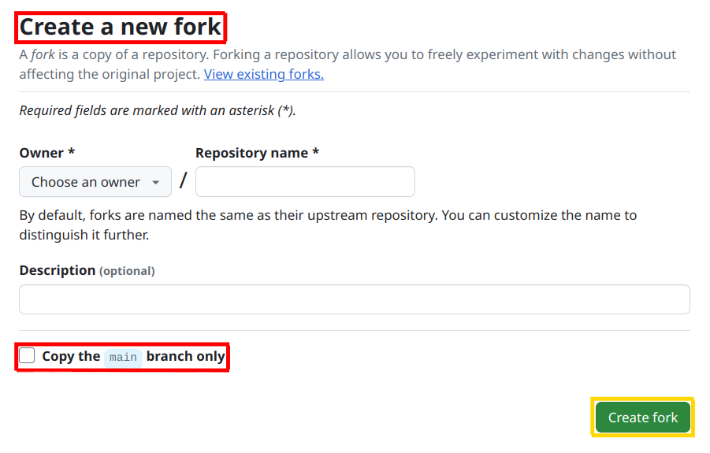

# Installation

The installation process is a modified version of [PyPSA-Eur Installation](https://pypsa-eur.readthedocs.io/en/latest/installation.html) instruction.

## Fork and Clone the Repository

To make modifications to the existing code base, it is necessary to create your own fork of this repository. In the **Create a new fork** pop-up menu, shown in the figure below, deselect the default **Copy the** `master` **branch only** option.

:::{admonition} Fork this repository!
:class: tip



:::

The repository consists of two additional branches outside of the `master` branch which contains the main code base for the study: `gh-pages`, which is necessary for rebuilding this documentation website, and `feature/calibrated-run`, which is required for generating the calibrated runs for the year 2023.

Then, clone your newly created repository using the version control system `git` in the command line.

```
git clone https://github.com/<your-username>/form-energy-storage
```


:::{admonition} Note
:class: note

If you want to try out the model as is, you can clone OETs version of [Form Energy Storage  PyPSA-Eur repository](https://github.com/open-energy-transition/form-energy-storage) instead. 
    
```
git clone https://github.com/open-energy-transition/form-energy-storage
```

:::


## Install Python Dependencies

PyPSA-Eur relies on a set of other Python packages to function. We recommend using the package manager [mamba](https://mamba.readthedocs.io/en/latest/) to install them and manage your environments. For instructions for your operating system follow the `mamba` [installation guide](https://mamba.readthedocs.io/en/latest/installation/mamba-installation.html). You can also use `conda` equivalently.

The package requirements are curated in the `envs/environment.yaml` file. There are also regularly updated pinned environment files for each operating system to ensure reproducibility (`envs/windows-pinned.yaml`, `envs/linux-pinned.yaml`, `envs/macos-pinned.yaml`). We recommend to use the pinned files for a stable environment, but you could also use the unpinned file.

```
mamba env create -f envs/linux-pinned.yaml # replace for your os
mamba activate pypsa-eur
```
:::{admonition} Note
:class: note

The equivalent commands for `conda` would be

```
conda env create -f envs/linux-pinned.yaml # replace for your os
conda activate pypsa-eur
```

:::

## Install a Solver

PyPSA passes the PyPSA-Eur network model to an external solver for performing the optimisation. PyPSA is known to work with the free software

- [HiGHS](https://highs.dev/)
- [Cbc](https://projects.coin-or.org/Cbc#DownloadandInstall)
- [GLPK](https://www.gnu.org/software/glpk/)
- ([WinGLKP](http://winglpk.sourceforge.net/))
- [SCIP](https://scipopt.github.io/PySCIPOpt/docs/html/index.html)

and the non-free, commercial software (for some of which free academic licenses are available)

- [Gurobi](https://www.gurobi.com/documentation/quickstart.html)
- [CPLEX](https://www.ibm.com/products/ilog-cplex-optimization-studio)
- [FICO Xpress Solver](https://www.fico.com/de/products/fico-xpress-solver)

For installation instructions of these solvers for your operating system, follow the links above. Commercial solvers such as Gurobi and CPLEX currently significantly outperform open-source solvers for large-scale problems, and it might be the case that you can only retrieve solutions by using a commercial solver. Nevertheless, you can still use open-source solvers for smaller problems.


