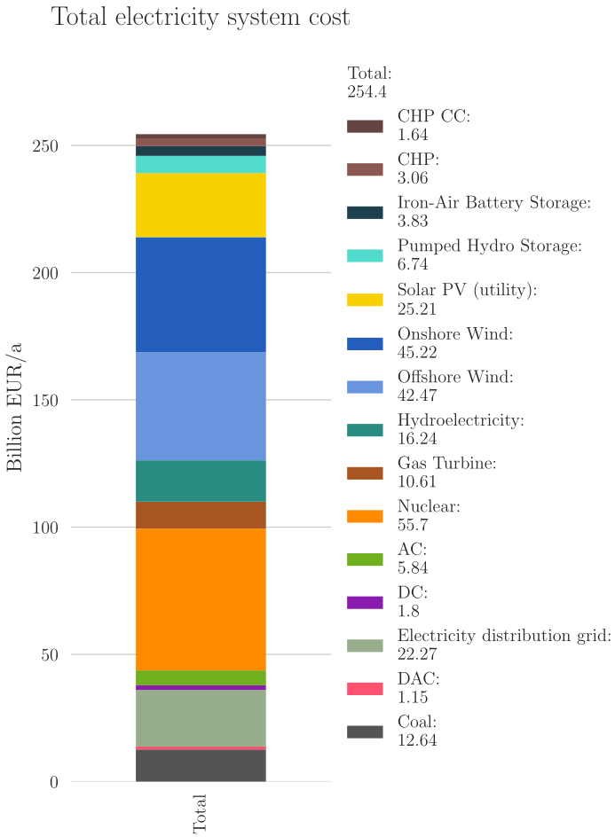
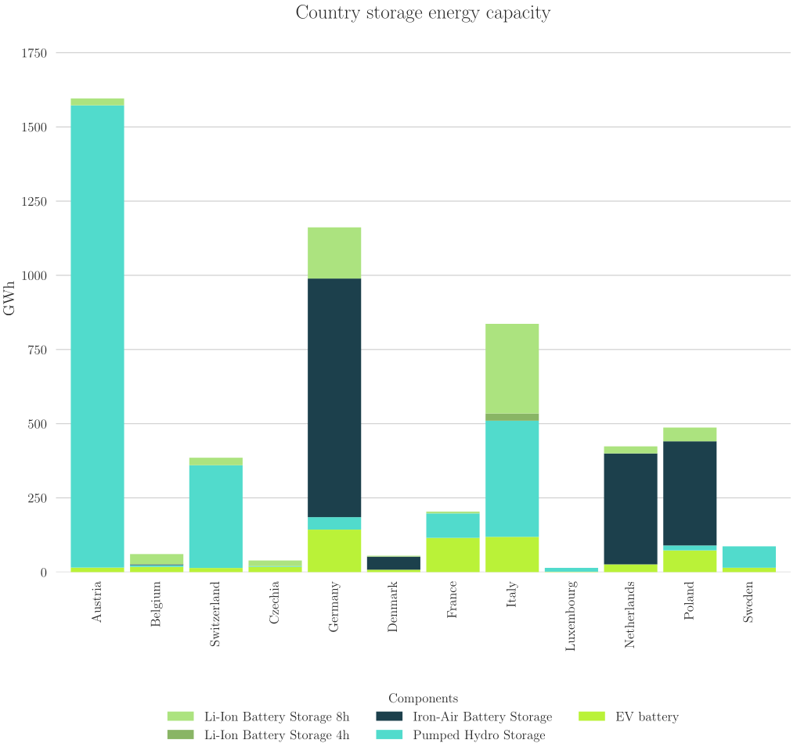
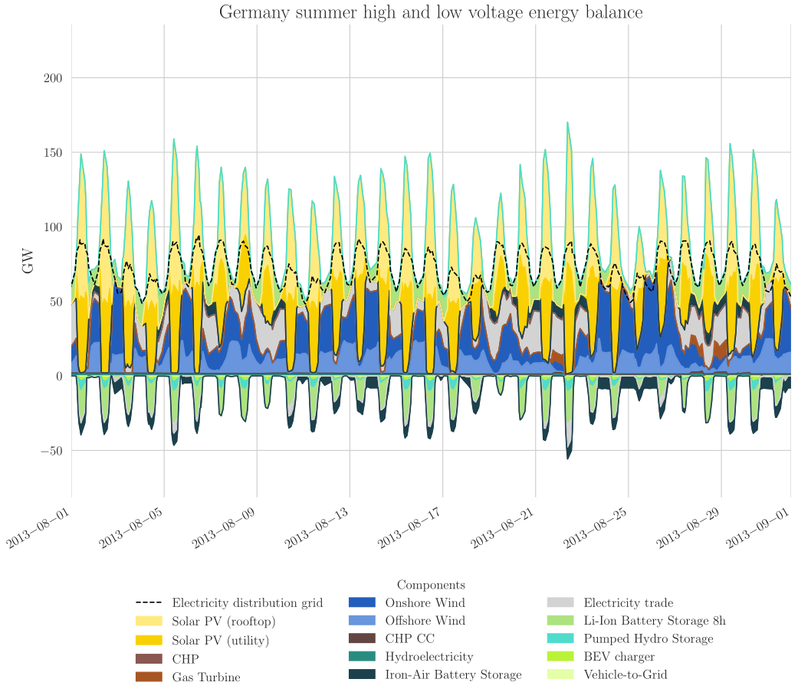

##########################################
KPIs Configuration
##########################################

`Plot_KPIs` creates both predefined and configurable figures. The predefined figures are:

* A map of curtailed energy for Germany and the wider region.
* A map of transmission line loading for Germany and the wider region.
* An overview plot of the energy trade.
* A summary CSV for storage capacities.

The configurable figures are defined based on ``config/config.kpi.yaml``.

.. note::
   The PyPSA-Eur configuration files follow a pyramid-like structure, where the parameters in the highest configuration file add to and override those in the configuration file below it. 
   The order is as follows:

   1. `scenarios.form.yaml <https://open-energy-transition.github.io/form-energy-storage/12-scenarios.html>`_
   2. `config.form.yaml <https://open-energy-transition.github.io/form-energy-storage/11-baseline.html>`_
   3. `config.default.yaml <https://pypsa-eur.readthedocs.io/en/latest/configuration.html>`_
   4. config.kpi.yaml (**this section**)

Thus, for example changes specified in `scenario.form.yaml` will add to and override configurations in `config.form.yaml` and so on.

Key components of each configuration:

1. ``extract``: Defines the network statistics for the figures (e.g., system cost, generation, storage, emissions).
2. ``include`` and/or ``exclude``: Specifies the regions or entities to include or exclude in the calculation (e.g., "DE" for Germany, "EU" for the European Union).
3. ``carrier_filter``: Specifies the energy carriers or technologies (e.g., power, electricity, storage, heat) relevant to the figure.
4. ``group_carrier``: Specifies the names used for each carrier. Same names are aggregated.
5. ``plot``: Determines the type of plot or visualization to be used (e.g., "detail" for detailed data, "overview" for broader data representation).
6. ``figsize``: Determines the figsize of the plots. If not defined, the default size are chosen.
7. ``plot_kw``: Additional keyword arguments for the plot (e.g., title, labels, and axis).

.. note::
    The head of the ``config/config.kpi.yaml`` file includes two options that will affect all plots:

    * ``enable_latex``: Saves the plot in LaTeX format.
    * ``include_csvs``: Saves a CSV file for each plot generated.

Components
---------------------------

``extract``
==========================

* **system cost**: Extract data from ``csvs/nodal_costs.csv``.
* **capacity**: Extract data from ``csvs/nodal_capacities.csv``.
* **capacity stats**: Extract capacity data from ``n.statistics``. See notes for more detail.
* **generation**: Extract power generation data from ``n.statistics.energy_balance``.
* **emission**: Extract emissions data based on emission links to the atmosphere.
* **energy balance**: Extract energy balance data from ``n.statistics.energy_balance``.
* **SOC**: Extract state of charge from the ``storage_units`` component.

.. note::
    **capacity stats** is a special option because it has two extra components:

    ``stats``: Extract capacity data from these three options:
    
    * **install**: Extract capacity data from ``n.statistics.installed_capacity``
    * **optimal**: (Default) Extract capacity data from ``n.statistics.optimal_capacity``
    * **expand**:  The difference between optimal minus install.

    ``storage``: If set to ``true``, only storage capacities of the component ``store`` and ``storage_units`` are taken into account.

``carrier_filter``
==========================

**a. for system cost, capacity, capacity stats, generation, and emission**:

* **electricity**: Filter carrier with AC bus carrier.
* **electricity+**: Filter carrier with AC bus carrier and also include water tanks and EV batteries.
* **storage**: Filter carrier with all storage-related technologies (``storage_units``, ``links``, and ``stores``).
* **storage-cap**: Filter carrier with all storage capacity-related technologies (``storage_units`` and ``links``).
* **storage-energy**: Filter carrier with all storage energy-related technologies (``storage_units`` and ``stores``).
* **power**: Filter carrier with power generation technologies.

.. note::
    **storage**, **storage-cap**, **storage-energy**, **power** is based on a list in ``config/config.kpi.yaml``.
    You can create your own filtering scheme by adding a list in ``kpi: filter_scheme``

    .. literalinclude:: ../config/config.kpi.yaml
       :language: yaml
       :start-at: power:
       :end-at: ]

**b. for energy balance**:

* **electricity**: Filter carrier with AC bus carrier.
* **electricity+**: Filter carrier with AC bus carrier and also include solar rooftops, BEV chargers, and Vehicle-to-Gas.
* **low voltage**: Filter carrier with low voltage bus carrier.
* **storage**: Filter carrier with all storage capacity-related technologies.
* **heat**: Filter carrier with heat bus carrier.
* **hydrogen**: Filter carrier with hydrogen bus carrier.

**c. for SOC**, this can be defined individually or in arrays of ``storage_units`` carriers.

``group_carrier``
==========================

* **pretty**: The first letter is capitalized, abbreviations are spelled out, and similar names are combined.
* **sector**: Aggregate all technologies into either the power sector, heating, transport sector, primary fuel, or CCUS.

Leaving this option empty will lead to the carriers using ``nice_names``.

``plot``
==========================

for system cost, capacity, capacity stats, generation, and emission:

* **detail**: A single bar plot is created with all the values annotated.
* **overview**: Multiple bar plots are created.

The plot for energy balance and SOC is always in a time-series format.

``figsize``
==========================

* For detail plots: the default figsize is (6,8)
* For overview, energy balance and SOC plots: the default figsize is (12,9)

``plot_kw``
==========================

* For system cost, capacity, capacity stats, generation, and emission, see `matplotlib.pyplot.bar documentation <https://matplotlib.org/stable/api/_as_gen/matplotlib.pyplot.bar.html>`__.
* For energy balance and SOC, see `pandas.DataFrame.plot documentation <https://pandas.pydata.org/docs/reference/api/pandas.DataFrame.plot.html#pandas.DataFrame.plot>`__.

Examples
------------------------

Detail Plots
==========================

.. literalinclude:: ../config/config.kpi.yaml
    :language: yaml
    :start-at: All_electricity_system_cost:
    :end-at: ylabel:

Explaination:

* A ``detail`` plot is one that displays the value of each carrier on the right side of a single bar plot. 
* In this example, the value represented is the ``system cost``. 
* This plot includes only the carriers related to ``electricity``. 
* The carrier names are based on the ``pretty_names`` defined in ``plot_KPIs.py``. 
* The title of the plot is ``Total electricity system cost``, with the unit in ``Billion EUR/a``. 
* The file is saved as ``{postnetwork}-All_electricity_system_cost_{planning_horizon}.pdf``.

The results are the figure below:

Overview Plots
==========================

.. literalinclude:: ../config/config.kpi.yaml
    :language: yaml
    :start-at: country_storage_energy_capacity:
    :end-at: ylabel:

Explaination:

* An ``overview`` plot displays the value of each carrier for all countries that are included, excluding those that are not relevant.
* ``["EU"]`` refers to buses that do not belong to any specific country. In this context, they are excluded from the plots as they are not relevant.
* In this example, the value represented is ``capacity stats``.
    * Since ``stats`` is not specified, the default ``optimal`` is chosen, and the data is extracted from ``n.statistics.optimal_capacity``.
    * As ``store`` is set to true, the data for storage capacities is extracted.
* This plot includes only the carriers listed in ``storage-cap``.
* The carrier names are based on the ``pretty_names`` defined in ``plot_KPIs.py``.
* The title of the plot is ``Country storage power capacity`` with the unit in ``GWe``.
* The file is saved as ``{postnetwork}-country_storage_power_capacity_{planning_horizon}.pdf``.

The results are the figure below:

Time Series Plots
==========================

.. literalinclude:: ../config/config.kpi.yaml
    :language: yaml
    :start-at: DE_electricity_summer_energy_balance:
    :end-at: ylabel:

Explaination:

* The value represented in this plot is the ``energy balance``.
* ``Energy balance`` means the resulting plot will be a time series (no need for a ``plot`` definition).
* This plot includes only the carriers related to ``electricity+`` which covers the high voltage carrier, as well as some low voltage generators such as PV (rooftop) and storages such as Battery Electric Vehicles.
* The carrier names are based on the ``pretty_names`` defined in ``plot_KPIs.py``.
* The title of the plot is ``Germany summer high and low voltage energy balance``, with the unit in ``GW``.
* The time series plot is limited to the snapshot dates between ``2013-08-01`` and ``2013-09-01``.
* The file is saved as ``{postnetwork}-DE_electricity_summer_energy_balance_{planning_horizon}.pdf``.

The results are the figure below:

