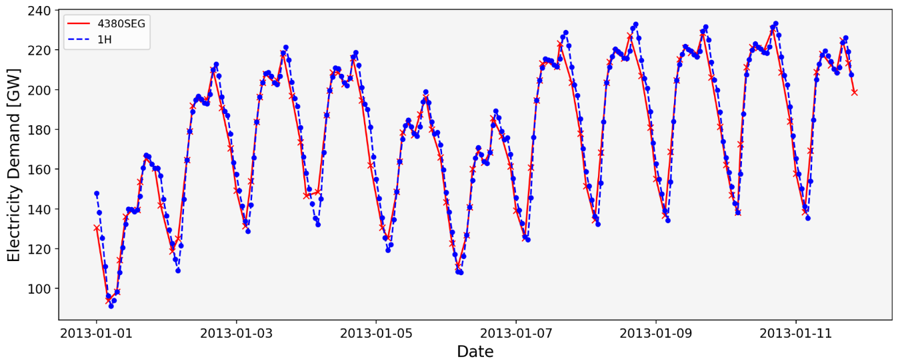

# Segmentation Temporal Clustering

There are different options available in PyPSA-Eur to cluster temporally:

- **xH**: Resampling the time resolution of an optimisation year by averaging every given number of time steps (x)  to one.
- **ySEG**: The alternative is the segmentation option, where time series segmentation is applied, creating a specified number of segments (y) of different lengths using a clustering algorithm. These segments consist of adjacent time steps that show similar characteristics based on capacity factors of intermittent renewables, hydro inflow and load.
    - For example, using **4380SEG** corresponds to an average temporal resolution of 2H.

The advantages of using **ySEG**:

- Higher resolution during hours of higher variability (e.g. during the day) with lower resolution during hours of less variability (e.g. during the night).
- Proven in previous studies as good compromise between computational time and accuracy of results.

Here are the comparison of metrics in past results:

| Temporal Resolution | Total System Cost [bEUR] | Curtailment [TWh] | CO2 price [EUR/tCO2] | Installed Iron-Air capacity [GW] | Computational time |
| ------------------- | --------------------------- | ----------------- | -------------------- | -------------------------------- | --------------------- |
| 1H                  | 399.7                       | 519.00            | 438.01               | 10.3                             | ~12h                  |
| 4380SEG (2H)        | 400.3                       | 519.00            | 435.48               | 10.0                             | ~4h                   |
| 2920SEG (3H)        | 400.0                       | 515.00            | 437.12               | 10.8                             | ~3h                   |

Here are the comparison of load time series using **4380SEG**:

